<h2>About me</h2>

Hi there! I'm **Laxus**. I like figuring things out by doing them, not by reading about them first.

- **Always working on something**
- Prefer building over talking about building
- Developing game servers & custom server mechanics
- Self-hosting infrastructure & tinkering with Linux setups
- Into tech, gaming, and whatever new rabbit hole shows up next

---

<h2 align="center">Technologies</h2>

  
  
  
  
  
  
  
  
  
  
  
  

---

<h2 align="center">Statistics</h2>

  
  

